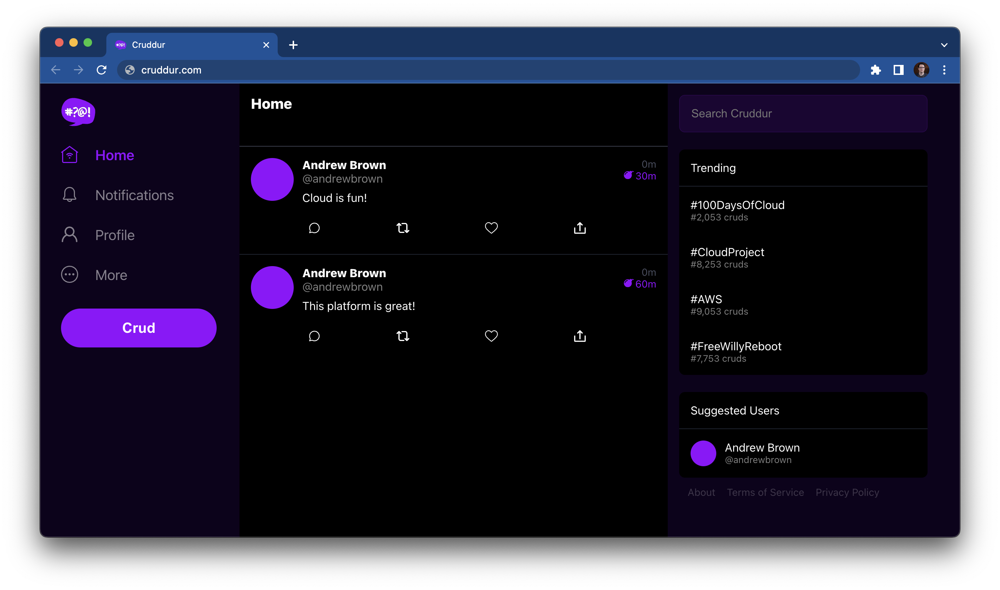

# AWS Cloud Project Bootcamp

> This is the starting codebase that will be used in the FREE AWS Cloud Project Bootcamp 2023

- Application: Cruddur
- Cohort: 2023-A1

## Developer Environments

| GitPod       | Github  |
|------------|-------------|
|        |  |

## Tech Stack

- fontend = React JS
- backend = Flask

## Screenshots

Screenshots

 

## Homework

The [`/journal`](./journal/) directory contains

Weeks

 

- ✅ [Week 0](journal/week0.md)
- ✅ [Week 1](journal/week1.md)
- [ ] [Week 2](journal/week2.md)
- [ ] [Week 3](journal/week3.md)
- [ ] [Week 4](journal/week4.md)
- [ ] [Week 5](journal/week5.md)
- [ ] [Week 6](journal/week6.md)
- [ ] [Week 7](journal/week7.md)
- [ ] [Week 8](journal/week8.md)
- [ ] [Week 9](journal/week9.md)
- [ ] [Week 10](journal/week10.md)
- [ ] [Week 11](journal/week11.md)
- [ ] [Week 12](journal/week12.md)
- [ ] [Week 13](journal/week13.md)

